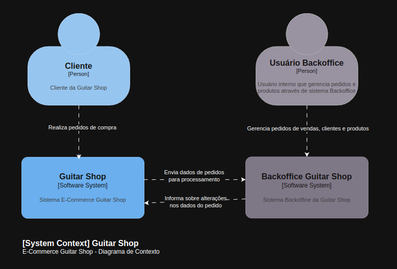
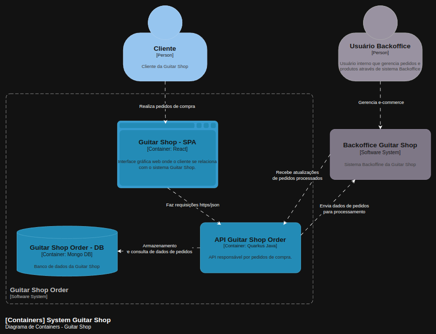
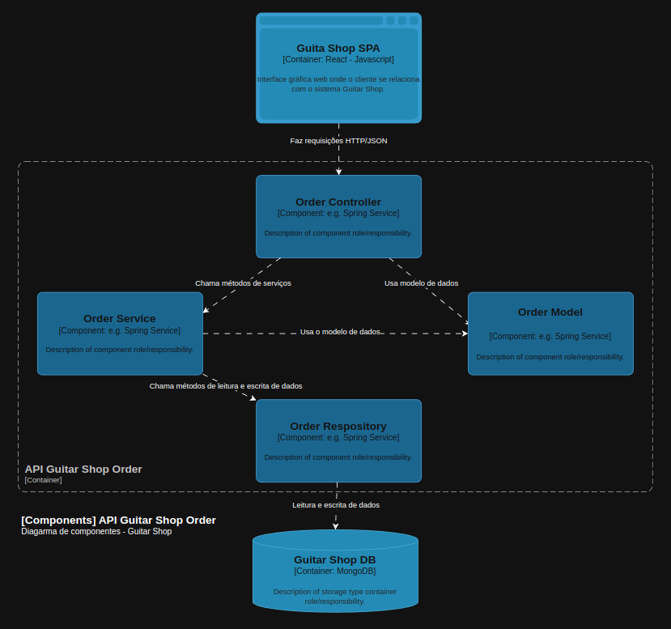

# Diagramas da Solução

Os diagramas foram escritos no padrão [C4 Model](https://c4model.com)

## Diagrama de Contexto - Nível 1 C4 Model

## Diagrama de Containers - Nível 2 C4 Model

## Diagrama de Components - Nível 3 C4 Model

#### [Voltar](../README.md)